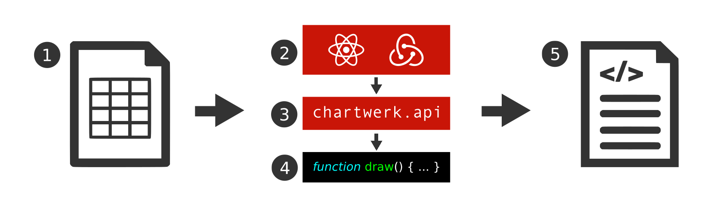

# How Chartwerk makes charts

Each chart in Chartwerk starts with a dataset and ends with a chart drawn from a template that has consumed that data. Strictly speaking, the process flow from data to chart in Chartwerk is like most other chart builders, except that the process happens more out in the open in Chartwerk's Editor. 

### How data becomes a chart

The following diagram represents the basic flow from tabular data to chart:

1. A user supplies tabular data to the Chartwerk Editor. This step presumes the user has already determined which chart type she wants to make and the Editor is preloaded with that chart template.
2. User makes selections in the Editor that determine how different features of this chart should be formatted, for example, axes and labels.
3. Chartwerk takes those user selections and any defaults which are part of the chart template and turns them into an API, which is defined as a global object, `chartwerk`.
4. The chart template includes scripts written to consume the API and draw the chart using whatever dependencies needed. These scripts are called in the Editor -- namely, the globally defined `draw()` function -- and create a live preview of the chart for the user.
5. After a user saves their chart, the Chartwerk backend app takes the API and the chart scripts and saves them to two flat HTML files: one for for each size of chart, double and single-wide. The flat file will call the chart's global drawing function, just as in the Editor, and draw the chart on the page. The file is saved on Amazon S3 or another hosting service or server and can then be embedded via an iframe into another page.

### Ownership of tasks in Chartwerk

- **Users** supply data and use the Editor's UI to specify chart format options. 

- **The Editor** turns user selections into an API.

- **Developers** write the chart scripts to consume the API and can also customize those scripts on any one chart or to create a new template.

- **The backend** application serves templates to load into the Editor, persists charts and templates to a database and bakes charts out to flat HTML.

